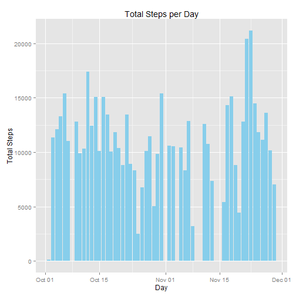
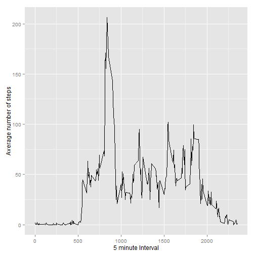
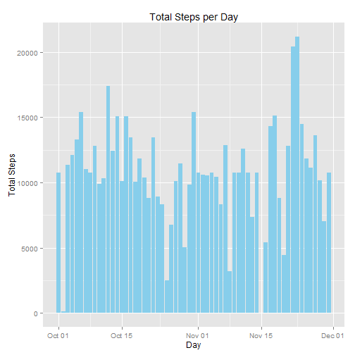
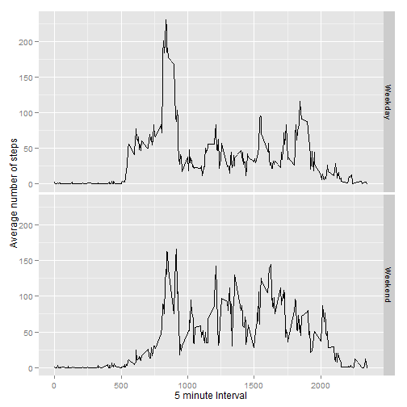

# Reproducible Research: Peer Assessment 1

## Loading and preprocessing the data

Read in the data and format the the date column in a date format  
Then print the first few rows to see what the data looks like  


```r
data<-read.csv("activity.csv")
data$date<-as.Date(data$date,"%Y-%m-%d")
head(data)
```

```
##   steps       date interval
## 1    NA 2012-10-01        0
## 2    NA 2012-10-01        5
## 3    NA 2012-10-01       10
## 4    NA 2012-10-01       15
## 5    NA 2012-10-01       20
## 6    NA 2012-10-01       25
```


## What is mean total number of steps taken per day?

Calculate the sum of steps in a day (missing values automatically removed)  
Use the ggplot2 plotting library to plot them  


```r
library(ggplot2)
daily_sum<-aggregate(steps~date,data,FUN = sum)
plot1<-ggplot(daily_sum, aes(x=date,y=steps))
plot1<-plot1+geom_bar(stat="identity",fill="sky blue")
plot1<-plot1+labs(x="Day",y="Total Steps",title="Total Steps per Day")
plot1
```

 

The mean and median steps in a day are:  


```r
mean(daily_sum$steps)
```

```
## [1] 10766
```

```r
median(daily_sum$steps)
```

```
## [1] 10765
```

## What is the average daily activity pattern?

First plot average number of steps per 5 minute intervals across all days  


```r
interval_av<-aggregate(steps~interval,data,FUN = mean)
plot2<-ggplot(interval_av, aes(x=interval,y=steps))
plot2<-plot2+geom_line()+labs(x="5 minute Interval", y= "Average number of steps")
plot2
```

 

The interval with the highest average value is  


```r
max_value<-max(interval_av$steps)
as.numeric(subset(interval_av, interval_av$steps==max_value,interval))
```

```
## [1] 835
```
## Imputing missing values

There are some missing values in the data - how many and is this an issue?


```r
sum(is.na(data$steps))
```

```
## [1] 2304
```

There are 2304 missing values  

These can be replaced based on using the mean value for the 5 minute interval  

Due to large variation in 5 minute intervals, and missing values for all of some days, this seems a better option than using daily means


```r
#calculate the average number of steps by interval
interval_av<-aggregate(steps~interval,data,FUN = mean)
names(interval_av)<-c("interval","AvSteps")
#merge averages onto original data
data2<-merge(data,interval_av,by="interval")
#work out where the missing values are
ind <- which(is.na(data2$steps), arr.ind=TRUE)
#replace the missing values
data2$steps[ind]<-data2$AvSteps[ind]
```

Plot total steps per day with new data:


```r
daily_sum2<-aggregate(steps~date,data2,FUN = sum)
plot3<-ggplot(daily_sum2, aes(x=date,y=steps))
plot3<-plot3+geom_bar(stat="identity",fill="sky blue")
plot3<-plot3+labs(x="Day",y="Total Steps",title="Total Steps per Day")
plot3
```

 

The new mean and median steps in a day are:  


```r
mean(daily_sum2$steps)
```

```
## [1] 10766
```

```r
median(daily_sum2$steps)
```

```
## [1] 10766
```

Inputing the missing values of steps has little impact on the overall averages, so having to remove the missing values from the first part didn't alter things greatly

## Are there differences in activity patterns between weekdays and weekends?

The data was split into Weekday/Weekend factors and then plotted as before  


```r
data2$DayType<-factor(weekdays(data2$date),levels=c("Monday","Tuesday","Wednesday","Thursday","Friday","Saturday","Sunday"))
levels(data2$DayType)<- c("Weekday","Weekday","Weekday","Weekday","Weekday","Weekend","Weekend")

DayType_av<-aggregate(steps~interval+DayType,data2,FUN = mean)
plot4<-ggplot(DayType_av, aes(x=interval,y=steps))
plot4<-plot4+geom_line()
plot4<-plot4+labs(x="5 minute Interval", y= "Average number of steps")
plot4<-plot4+facet_grid(DayType~.)
plot4
```

 

Overall we can see that weekdays have more steps occuring in the early morning compared to weekends
